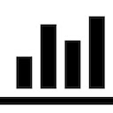

 

  

  <h3 align="center">NYRR But Good</h3>

  

    <a href="https://chrome.google.com/webstore/detail/nyrr-pace-chart-but-good/geoakillbohhijpiofbfakijiabaadff">Chrome Web Store</a>
    ·
    <a href="https://github.com/tedbrakob/nyrr-pace-chart-but-good">Github</a>
  

 

The graph view of NYRR's results pages shows the overall mean pace at each split rather than the actual split pace.  This extension updates the chart's data to show actual pace for each split.

 

---

 

Dev tip:
The angular controller from NYRR to handle the graph can be found in the "app" bundle by searching the file for "runnerGraphController".